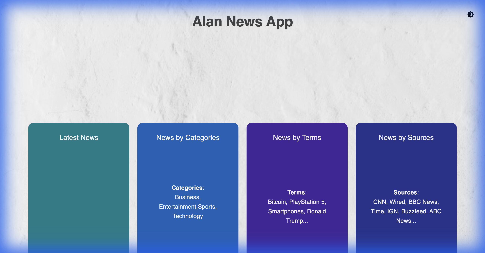
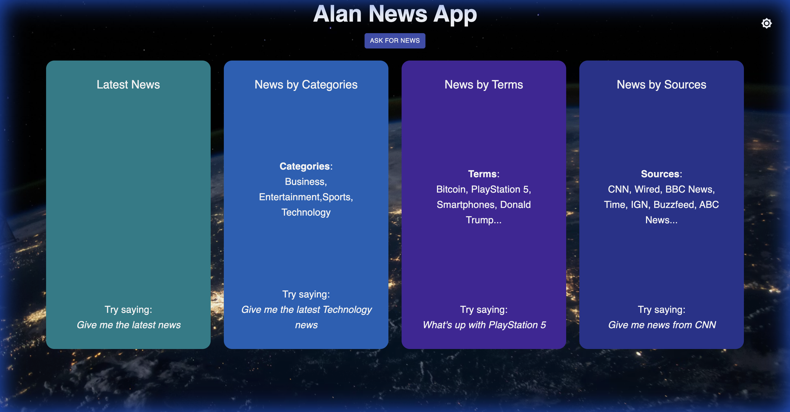

# Alan AI News Application 🎙️📰

A Conversational Voice Controlled React News Application using **Alan AI**. This app allows users to find news by categories, terms, and sources using voice commands.

### Light Mode


### Dark Mode


## 🌐 Live Demo

🔗 **Live Site:**  
https://alanainews-react.netlify.app/

## 🌟 Features

### Ask for News Button

An **"Ask for News"** button is provided to help you get started quickly. Clicking this button immediately opens the microphone, so you can simply say commands like *"Give me the latest news"* or *"Show me business news"* without needing to say the hotword first.

## 🛠️ Technology Stack

*   **React JS**: Frontend framework.
*   **Alan AI**: Voice AI integration sdk.
*   **Material UI**: Styling and components.
*   **NewsAPI.org**: Source for news data.
*   **AOS (Animate On Scroll)**: Scroll animations.

## 🚀 Getting Started

### Prerequisites

*   Node.js (v14 or higher)
*   npm or yarn
*   Alan AI Studio Key

### Installation

1.  **Clone the repository**
    ```bash
    git clone https://github.com/ajf013/Alan-AI-Application.git
    cd Alan-AI-Application
    ```

2.  **Install dependencies**
    ```bash
    npm install
    ```

3.  **Setup Environment Variables**
    Create a `.env` file in the root directory and add your Alan AI Key:
    ```env
    REACT_APP_ALAN_KEY=your_alan_ai_key_here
    ```

4.  **Run the application**
    ```bash
    npm start
    ```
    Open [http://localhost:3000](http://localhost:3000) to view it in the browser.

## 🗣️ Voice Commands to Try

*   *"Give me the latest news"*
*   *"Open article number [4]"*
*   *"Go back"*
*   *"What is this app?"*
*   *"Make it dark/light"* (if configured in Alan Studio script)

## 🚢 Deployment

This app is ready to be deployed on **Netlify** or **Vercel**.
See `netlify_deployment.md` for specific Netlify instructions.

## 👤 Author

**Francis Cruz**

## You can reach out 😊😊
Feel free to contact me about the problems. I will try to help as much as I can 😉

[](https://www.linkedin.com/in/ajf013-francis-cruz/)
[](mailto:cruzmma2021@gmail.com)
[](https://github.com/ajf013)